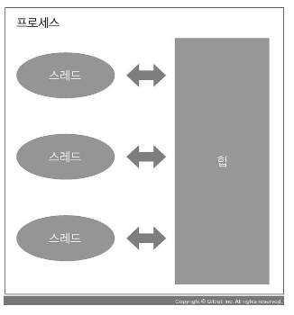
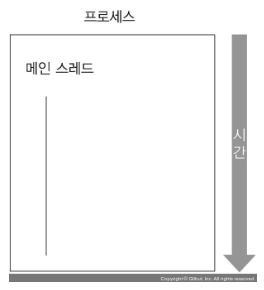
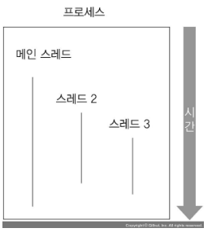
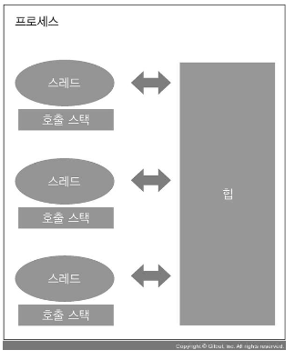
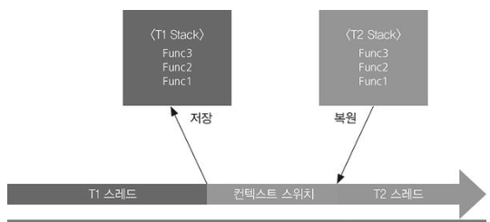
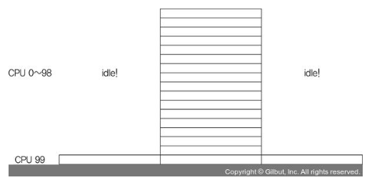
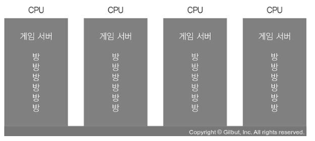
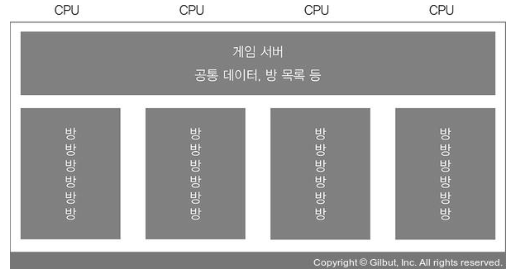
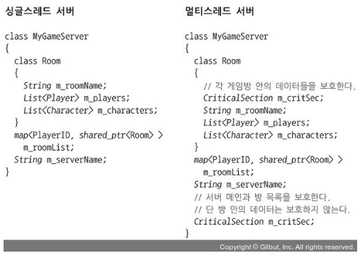

# 멀티 쓰레딩

## 1.1 프로그램과 프로세스 

- 프로그램 이란 컴퓨터에서 실행되는 명령어 모음이 들어 있는 데이터 덩어리 코드(code) 와 데이터(Data) 로 구성 프로그램을 실행하면 명령어가 한 줄 씩 실행되면서 활동하는 상태가 되고 이를 프로세스(Process) 라고 한다. 
- 코드와 데이터는 이 프로세스 메모리로 불러들인다. 
- 프로세스 메모리에는 프로그램 코드와 데이터는 물론 힙(heap)과 스택(stack)도 공존한다 스택(stack)에는 현재 실행중인 함수들의 호출 기록과 로컬 변수가 들어있다. 

아래와 같이 프로세스가 여러 개 실행되고 있는 것을 멀티프로세싱 이라고 한다.

## 1.2 스레드 

- 각 프로세스에는 독립된 메모리 공간이 있다. 
- 기본적으로 서로 다른 프로세스는 상대방의 메모리 공간을 읽고 쓸 수 없다. 
### 스레드 vs 프로세스 
- 스레드는 한 프로세스 안에 여러개가 있다. 
- 한 프로세스 안에 있는 스레드는 프로세스 안에 있는 메모리 공간을 같이 사용할 수 있다. 
- 스레드 마다 스택을 가진다. 각 스레드에서 실행되는 함수의 로컬 변수들이 스레드마다 존재한다.

### 싱글스레드 

프로그램을 실행하면 프로세스가 생성되고 유일한 스레드가 존재하는 프로그램을 싱글스레드 프로그램이라고 한다.

### 멀티스레드 

프로세스 안에서 여러 스레드를 생성 시킬 수 있으며, 이런 스레드들이 동시에 한꺼번에 실행된다. 

이렇게 여러 스레드가 동시에 여러가지 일을 처리하게 하는 것을 `멀티스레드` 라고 한다.

~~~
  t2 = CreateThread(Thread2Proc);
}
 
void Thread2Proc()
{
  t3 = CreateThread(Thread3Proc);
}
 
void Thread3Proc()
{   ...
~~~

프로그램이 시작될때 main()함수가 실행되고, 메인 함수를 시작점으로 많은 함수가 실행된다.

함수는 실행이 끝나면 자기 자신을 호출 했던 호출자 함수를 실행했던 지점으로 되돌아 가야 한다.

이러한 정보가 저장되어 있는 곳을 `호출 스택` 이라고 한다.

- 호출 스택 안에는 각 함수 안에 선언된 `지역 변수` 도 같이 들어 있다.

- 각 쓰레드는 각자 호출 스택을 가진다.

## 1.3 멀티스레드 프로그래밍은 언제 해야 할까?

1. 오래 걸리는 일 하나와 빨리 끝나는 일 여럿을 같이 해야 할때
2. 어떤 긴 처리를 진행하는 동안 다른 짧은 일을 처리해야 할 때
3. 기기에 있는 CPU를 모두 활용해야 할 때

## 1.4 스레드 정체

여러 프로세스와 여러 스레드를 동시에 실행해야 하는 운영체제는 이렇게 여러 프로세스와 각 프로세스 안에 있는 스레드들을

일정 시간마다 번갈아 가면서 실행합니다.

각 스레드를 실행하다 말고 다른 스레드를 마저 실행하는 과정을 `컨텍스트 스위치` 라고 한다.

### 컨텍스트 스위치

우선 실행 중이던 스레드의 상태를 어딘가에 저장하고, 과거에 실행하다가 만 다른 스레드 중에서 하나 고른다.

고른 스레드의 상태를 복원하고 그런 다음 실행하던 지점으로 강제 이동해야 한다.

> 컨텍스트 스위치를 하는데 연산량이 많다 보니, 동시에 실행해야 하는 스레드가 여럿이라 하더라도 컨텍스트 스위치를 지나치게 자주 하면
> 
> 배보다 배꼽이 더 커지기도 한다.

우리가 알아야 할 것은 CPU 개수와 스레드 개수의 관계 이다.

- CPU 개수와 스레드 개수가 같거나 스레드 개수가 더 적으면 컨텍스트 스위치가 발생할 이유가 없다.
- 하지만 스레드 개수가 더 많으면 컨텍스트 스위치가 반드시 어느 CPU 안에서는 발생한다.
- 다만 Runnable 상태의 스레드가 CPU 개수 보다 많을 경우 성능 문제가 될 뿐이다.
- Waitable 상태의 스레드는 성능 문제가 없다.
- 컨텍스트 스위치는 기계어 명령어 단위로 이루어 진다.

> 즉 우리가 만든 프로그램이 스레드가 많더라도, 정작 Runnable인 쓰레드 개수가 CPU개수보다 적다면 별 문제가 없다.

## 1.5 스레드를 다룰 때 주의 사항

- 두 스레드가 데이터에 접근해서 그 데이터 상태를 예측할 수 없게 하는 것을 `경쟁 상태` 혹은 `데이터 레이스` 라고 한다.

두 스레드가 동시에 Array<int>의 Add() 함수를 호출하면 여러 스레드가 Array<int> 변수들을 변경합니다. 

그러면 두 변수 중 하나만 변경된 상태에서 다른 스레드가 그대로 배열을 액세스하겠지요. 

이 과정에서 배열을 가리키는 포인터 변수는 엉뚱한 값, 

예를 들어 이미 힙에서 해제된 메모리를 잠시 가리킬 수도 있습니다. 

충돌이 발생하는 이유는 바로 이 때문입니다. 이 역시 `데이터 레이스` 현상 중 하나입니다.

> 따라서 Array<int>를 스레드가 액세스할 때는 Array<int> 안의 두 멤버 변수를 모두 바꾸든지, 아니면 하나도 바꾸지 않든지 해야 합니다.
> 
> 즉, 두 멤버 변수를 건드리는 동안에는 다른 스레드가 절대 건드리지 못하게 해야 합니다.
>
> 이를 원자성(atomicity)이라고 합니다. 
>
> 그래야 Array<int>의 두 변수는 항상 일관성 있는 상태를 유지할 수 있습니다. 
>
> 이를 일관성(consistency)이라고 합니다.

` 이러한 원자성과 일관성을 유지하는 특수한 조치를 하는데 이러한 조치를 동기화 라고 하며 ` 대표적으로 `임계 영역` 과 `뮤텍스`, `잠금` 기법 이다.

## 1.6 임계 영역과 뮤텍스

다른 스레드는 X를 건드리려고 하면 기다린다. 현재 스레드가 X를 다 사용할 때 까지

이때 사용하는 것이 `뮤텍스` 이다. 뮤텍스는 상호 배제의 줄임말이다.

- 사용방법
    1. X, Y를 보호하는 뮤텍스 MX를 만듭니다.

    2. 스레드는 X, Y를 건드리기 전에 MX에 “사용권을 얻겠다.”라고 요청합니다.

    3. 스레드는 X, Y를 액세스합니다.

    4. 액세스가 끝나면 MX에 “사용권을 놓겠다.”라고 요청합니다.

~~~
std::mutex mx;   
lock();          
read(x);         
write(y);        
sum(x);          
mx.unlock();

~~~

C# 언어 에서는 lock 과 unlock 할 때 다음과 같이 한다.
1. 보호하려는 변수 자체를 뮤텍스 처럼 사용하여 잠근다. 혹은 변수를 가리키는 임의의 객체를 따로 만들어 그 객체를 잠근다(lock)
2. 다 쓰고 나면 잠금을 해제한다(unlock)

- 다음과 같이 lock 구문 블록을 이용하면 별도의 unlock()을 호출하지 않아도 구문 블록을 나갈 때 자동으로 잠금 해제가 된다.
~~~c#
object mx = new object();
lock(mx)
{
  read(x);
  write(y);
  sum(x);
}
~~~

C++ 에서는 아래와 같이 사용한다.
~~~C++
// C++ 코드
std::mutex mx;
{
  std::lock_guard<std::mutex> lock(mx);
  read(x);
  write(y);
  sum(x);
}
~~~

#### 교착상태

~~~
class Player
{
    CriticalSection m_positionCritSec;
    Vector3 m_position;  
    CriticalSection m_nameCritSec;
    string m_name;       
    CriticalSection m_hpCritSec;
    int m_hp;            
}
~~~

각 클래스의 멤버 변수마다 뮤텍스를 두었고 이 변수들은 무조건 순서대로 액세스 한다는 규칙을 지키면서 코딩해야

`교착 상태` 를 피할 수 있다.

- 뮤텍스 범위는 적당히 넓게 나누는 것이 좋다. 동시에 (여러 CPU가 병렬로) 연산하면 유리한 부분은 잠금 단위로 나누고, 병렬로 하지 않아도
- 별로 성능에 영향을 주지 않는 부분들은 잠금 단위를 나누지 않는 것이 좋다.

## 1.7 교착상태

멀티스레드 프로그래밍 에서 `교착 상태란 두 스레드가 서로를 기다리는 상황`을 의미한다.

스레드 1은 스레드 2가 하던 일이 끝날 때 까지 기다리는데, 정작 스레드 2는 스레드 1이 하던 일이 끝날 때 까지 기다리는 상황이다.

이러한 경우 두 스레드는 영원히 멈추어 있다.

- 게임 서버에서 교착 상태가 되면 발생하는 현상은 다음과 같다.
1. CPU 사용량이 현저히 낮거나 0% 이다. 동시 접속자 수와 상관 없다.
2. 클라이언트가 서버를 이용할 수 없다. 뭔가 요청을 보냈는데 응답이 오지 않는다.

## 1.8 잠금 순서의 규칙

여러 뮤텍스를 사용할 때 교착 상태를 예방하려면 각 뮤텍스의 잠금 순서를 먼저 그래프로 그려 두어야 한다.

그리고 잠금을 할 때는 잠금 순서 그래프를 보면서 거꾸로 잠근 것이 없는지 체크해야 한다.

예를 들어 뮤텍스 A·B·C가 있다고 가정했을 때, 이들의 잠금 순서는 다음과 같습니다.

A → B → C    

여러분 코드가 이와 동일한 순서(A → B → C)로 잠근다고 할 때, 이를 코드로 표현하면 다음과 같습니다.

~~~
lock(A)
lock(B)
lock(C)
unlock(C)
unlock(B)
unlock(A)
//위의 잠금 순서를 잘 지켰으므로 이때는 교착 상태를 전혀 일으키지 않습니다
~~~

B → A 순서로 잠그면 그제야 교착 상태를 일으킬 수 있습니다. 위의 잠금 순서를 어겼기 때문입니다.

~~~
lock(B)
lock(A)
unlock(A)
unlock(B)
~~~

교착 상태를 예방하려면 잠금 순서를 지켜야 합니다. 

그렇다면 잠금을 해제하는 순서는 교착 상태에 영향을 줄까요? 다행히 전혀 영향을 주지 않습니다. 

잠금을 해제하는 순서는 여러분 마음대로 한다 해도 교착 상태를 일으키지 않습니다.

다음 한 가지만 기억해라

> 교착 상태를 예방하려면 첫 번째 잠금 순서를 지켜야 한다(거꾸로 가지 말아야 한다).

## 1.9 병렬성과 시리얼 병목

앞서 언급했듯이, 뮤텍스가 보호하는 영역이 너무 넓으면 스레드가 여럿이라 하더라도 하나일 때와 별반 차이가 없습니다. 

여러 CPU가 각 스레드의 연산을 실행하여 동시 처리량을 올리는 것을 `병렬성(parallelism)`이라고 합니다. 

그런데 어떤 이유로 이러한 병렬성이 제대로 나오지 않는 것, 

즉 병렬로 실행되게 프로그램을 만들었는데 정작 한 CPU만 연산을 수행하는 현상을 `시리얼 병목(serial bottleneck)`이라고 합니다.

CPU 개수가 많아질수록 빈 공간은 넓어집니다. 

이는 병렬로 처리할 수 없는 구간, 즉 시리얼 병목이 존재하는 시간이 길어질수록 총 처리량은 줄어들 수밖에 없다는 의미입니다. 

이처럼 시리얼 병목이 있을 때, CPU 개수가 많을수록 총 처리 효율성이 떨어지는 현상을 가리켜 `암달의 법칙(Amdahl’s Law)` 혹은 `암달의 저주`라고 합니다.

## 1.10 싱글스레드 게임 서버

많은 상용 게임 서버는 CPU가 여러 코어로 구성되어 있습니다. 

따라서 게임 서버를 싱글스레드로 구동하는 경우 코어 하나만 사용하게 되는 비효율성 문제가 생깁니다. 

싱글스레드 서버를 구동하는 경우 CPU 개수만큼 프로세스를 띄우는 것이 일반적입니다.

- 각 서버 프로세스는 방(room) 을 여러개 가진다. 방에서는 플레이어 하나 이상 이 싱글 혹은 멀티플레이를 한다.

싱글스레드로 게임 서버를 만드는 경우, 

디스크에서 플레이어 정보를 로딩할 때 발생하는 디바이스 타임을 처리하는 과정에서 큰 시리얼 병목이 일어납니다. 

이를 해결하고자 `비동기 함수`나 `코루틴` 같은 것을 사용하기도 합니다. 

부득이한 경우가 아니면 방 개수나 플레이어 개수만큼 스레드 혹은 프로세스를 띄우는 것은 피하기 바랍니다.

1. 방 개수만큼 스레드나 프로세스가 있으면 스레드나 프로세스 간 컨텍스트 스위치의 횟수가 증가합니다.

2. 따라서 같은 동시접속자를 처리하는 서버라고 하더라도 실제로 처리할 수 있는 동시접속자 수를 크게 떨어뜨립니다.

## 1.11 멀티스레드 게임 서버

멀티스레드로 서버를 개발하는 경우는 주로 다음과 같습니다.

1. 서버 프로세스를 많이 띄우기 곤란할 때. 예를 들어 프로세스당 로딩해야 하는 게임 정보(맵 데이터 등)의 용량이 매우 클 때(특히 MMO 게임 서버)

2. 서버 한 대의 프로세스가 여러 CPU의 연산량을 동원해야 할 만큼 많은 연산을 할 때

3. 코루틴이나 비동기 함수를 쓸 수 없고 디바이스 타임이 발생할 때

4. 서버 인스턴스를 서버 기기당 하나만 두어야 할 때

5. 서로 다른 방8이 같은 메모리 공간을 액세스해야 할 때

멀티스레드 게임 서버는 잠금 범위를 설정해 주어야 하는데, 보통은 방 단위로 잠금 범위를 설정하는 것이 적정합니다.

> 플레이어가 한 명 이상 같이 모여서 플레이하는 공간 1개를 방(room)이라고 한다.

- 플레이어 행동에 대한 처리는 각 방을 잠근 후에 한다. 
1. 공통 데이터(방 목록 등)를 잠급니다.

2. 플레이어 A가 들어 있는 방을 방 목록에서 찾습니다.

3. 공통 데이터를 잠금 해제합니다.

4. 찾은 방을 잠급니다.

5. 플레이어 A의 방 안에서 처리를 합니다.

6. 방을 잠금 해제합니다.

~~~
MyGameServer.DoSomething(playerID)
{
  lock(m_critSec);
  room = m_roomList.find(player);
  Unlock(m_critSec);
 
  lock(room.m_critSec);
  room.DoSomething(playerID);
  Unlock(room.m_critSec);
}
~~~

> 멀티스레드 게임 서버를 만들 때 크게 주의할 점은 `시리얼 병목` 과 `교착 상태` 이다.

## 1.12 스레드 풀링

우리가 생각해 볼 수 있는 쉬운 개발 방법 중 하나는 클라이언트 마다 스레드를 배정해 주는 것이다.

하지만 스레드 개수가 많을 경우 여러 문제가 발생한다.

- 각 스레드는 호출 스택을 가지는데 이것의 크기는 작게는 수십 킬로바이트, 에서 수 메가 바이트에 이른다.
- 스레드가 5000개 고 스레드마다 호출 스택을 `1메가 바이트` 차지할 경우 필요한 메모리는 `5000` 메가 바이트에 이른다.
- 또 다른 심각한 문제는 `컨텍스트 스위치 현상` 이다.

> 요즘은 스레드 개수를 클라이언트 개수 만큼 두는 일은 거의 없으며 그대신 `스레드 풀링`을 한다.

그래서 스레드 개수를 어떻게 하면 되냐?

-  어떤 서버의 주 역할이 CPU 연산만 하는 스레드라면(즉, 디바이스 타임이 없다면) 스레드 풀의 스레드 개수는 서버의 CPU 개수와 동일하게 잡아도 충분합니다.

- 서버에서 데이터베이스나 파일 등 다른 것에 액세스하면서 디바이스 타임이 발생할 때 스레드 개수는 CPU 개수보다 많아야 합니다.

## 1.13 이벤트

이벤트는 쉽게 말해서 잠자는 스레드를 깨우는 도구로, 내부적으로 다음 상태 값을 가집니다.

- Reset: 이벤트가 없음이라는 의미입니다. 정수 값으로 표현하자면 0입니다.

- Set: 이벤트가 있음이라는 의미입니다. 정수 값으로 표현하자면 1입니다.

## 1.14 세마포어

뮤텍스나 임계 영역은 오로지 스레드 1개만 자원을 액세스할 수 있게 합니다. 

하지만 세마포어는 원하는 개수의 스레드가 자원을 액세스할 수 있게 합니다.

- 세마포어는 상태 값을 가지고 있으며, 그 값은 0 이상의 정수입니다. 초깃값은 앞서 설정했던 ‘최대 액세스 가능한 스레드 개수’입니다. 스레드가 세마포어에 자원 액세스를 요청하면 상태 값은 1 감소합니다. 그리고 스레드는 자원 액세스를 허가받습니다. 다른 스레드도 자원 액세스를 요청합니다. 결국 상태 값은 0이 되고 말 것입니다.

- 세마포어는 상태 값이 0인 상황에서는 자원 액세스를 허락하지 않기 때문에 스레드가 자원 액세스를 요청하면 그 스레드는 잠자게 됩니다. 자원 액세스를 마친 스레드는 세마포어에 ‘자원 액세스가 끝났음’을 통보합니다. 실제로 이 일은 세마포어의 상태 값을 1 증가시킵니다. 그러면 세마포어의 상태 값이 1 증가한 시점에서, 이미 어떤 스레드가 자원 액세스를 기다리고 있었다면 해당 스레드를 깨웁니다. 그리고 상태 값은 1 감소합니다.

예를 소개한다.

두 스레드 간에 공유되는 큐(queue)가 있다고 가정하겠습니다.

한 스레드는 큐에서 항목을 꺼내고, 큐가 비어 있으면 무언가가 들어올 때까지 잠을 잡니다. 

나머지 스레드는 큐에 항목을 넣습니다.

- 이벤트를 하나 준비합니다. 이 이벤트는 ‘큐에 뭔가가 있다’를 알리는 역할을 합니다.

- 스레드 1은 이벤트를 기다립니다. 그리고 큐에서 항목을 꺼냅니다.

- 스레드 2는 큐에 항목을 넣고 이벤트에 신호를 줍니다.

~~~
Queue queue;
Event queueIsNotEmpty;
 
void Thread1()
{
  while (true)
  {
      queueIsNotEmpty.Wait();
      queue.PopFront();
  }
}
 
void Thread2()
{
  while (true)
  {
      queue.PushBack();
      queueIsNotEmpty.SetEvent();
  }
}
~~~

얼핏 보면 잘 작동할 것 같습니다. 그러나 이 코드는 다음 문제가 있습니다. 매우 짧은 순간에 이 순서로 일을 할 수도 있기 때문입니다.

1. 스레드 1에서 이벤트를 기다립니다. 이벤트 상태 값은 0입니다. 큐는 비어 있습니다.

2. 스레드 2에서 이벤트에 신호를 줍니다. 이벤트 상태 값은 1이 됩니다. 큐에 항목이 1개 있습니다.

3. 스레드 1이 깨어납니다. 이벤트 상태 값은 0입니다. 큐에서 항목을 꺼냅니다. 큐에 항목이 0개가 됩니다.

4. 나머지

스레드 2가 두 번 일을 해 버리면, 결국 최종 상태에서 큐는 항목이 있음에도 이벤트 상태 값이 0이 됩니다. 그러면 스레드 1은 큐에 뭔가 할 일이 있어도 계속 기다리는 상황이 되어 버립니다

이럴 때 사용하는 것이 `세마포어` 이다

#### 세마포어를 적용한 코드
~~~
Queue queue;
Semaphore queueIsNotEmpty;
 
void Main()
{
  // 초깃값이 0인 세마포어를 만든다.
  queueIsNotEmpty = new Semaphore(0);
}
 
void Thread1()
{
  while (true)
  {
      queueIsNotEmpty.Wait();
      queue.PopFront();
  }
}
 
void Thread2()
{
  while (true)
  {
      queue.PushBack();
      queueIsNotEmpty.Release();
  }
}
~~~

## 1.15 원자 조작

`원자 조작(atomic operation)`은 뮤텍스나 임계 영역 잠금 없이도 여러 스레드가 안전하게 접근할 수 있는 것을 의미합니다. 원자 조작은 하드웨어 기능이며, 대부분의 컴파일러는 원자 조작 기능을 쓸 수 있게 합니다.

원자 조작은 32비트나 64비트의 변수 타입에 여러 스레드가 접근할 때 한 스레드씩만 처리됨을 보장합니다. 그러나 변수 값 2~3개 이하에서만 보호해 주며, 변수를 읽거나 쓰는 방식도 몇 개 안 됩니다.

원자 조작은 대표적으로 다음과 같은 것이 있습니다.

- 원자성을 가진 값 더하기

- 원자성을 가진 값 맞바꾸기

- 원자성을 가진 값 조건부 맞바꾸기

여기서 원자성을 가진 값 더하기란 “변수에 무슨 값이 있는지는 모르지만, 그 값에 특정 값을 더하고 그 값의 결과를 얻어 온다.”라는 의미입니다

## 1.16 멀티스레드 프로그래밍의 흔한 실수들

#### 1.16.1 읽기와 쓰기 모두에 잠금하지 않기

먼저 멀티스레드 프로그래밍을 시작하는 사람들에게서 흔히 볼 수 있는 실수를 알아봅시다. 

> 메모리에 값을 쓰고 있는데 다른 스레드가 그것을 읽으면 망가질 수 있다는 것은 인지하지만,
> 
> 그냥 값을 읽고만 있으면 잠금을 하지 않더라도 안전하다는 막연한 생각 때문에 발생합니다.

#### 1.16.2 잠금 순서 꼬임

잠금 순서 규칙을 최대한 적게 유지하는 것이 좋다.

~~~
int a;
mutex a_mutex;
 
int b;
mutex b_mutex;
 
void func1()
{
  lock(a_mutex);
  a...;
  lock(b_mutex);
  b...;
}
 
void func2()
{
  lock(b_mutex);
  b...;
  lock(a_mutex);
  a...;
}
~~~
#### 1.16.3 너무 좁은 잠금 범위

잠금 객체 범위가 너무 넓으면 컨텍스트 스위치가 발생할 때 운영체제가 해야 할 일이 매우 많아집니다. 그리고 처리 병렬성이 떨어지기 때문에 멀티스레드 프로그래밍의 이유가 퇴색되기도 합니다.

- 임계 영역을 적당한 수준에서 나누면 좋습니다.

#### 1.16.4 디바잇 타임이 섞인 잠금

디바이스 타임(1.9절 참고)이 있을 때는 다른 스레드가 자주 접근하는 리소스에 대한 잠금을 하지 말아야 하는데도, 우리는 알게 모르게 디바이스 타임이 섞인 잠금을 하는 실수를 하고는 합니다. 

그중 특히 자주 하는 실수는 `로그 출력`이나 `콘솔 출력`입니다.

- 물론 콘솔 출력이나 로그 출력이 디스크나 네트워크 I/O의 디바이스 타임만큼 긴 시간(보통 수백 마이크로초)은 아니지만,
- 콘솔 출력은 게임 서버에서 통상적인 연산 처리보다는 훨씬 많은 시간을 차지합니다.

> 게임 서버를 개발할 때 디버깅 목적으로 많은 콘솔 출력을 뿌릴 때기 있는데, 이때 게임 서버의 메모리 영역에 잠금을 하는 사람이 많을 것입니다. 그런데 이 과정에서 서버 처리를 할 때 병목 현상이 발생합니다.

#### 1.16.5 잠금의 전염성으로 발생한 실수

잠금으로 보호되는 리소스(변수 값 등)에서 얻어 온 값이나 포인터 주소 값 등이 로컬 변수로 있는 경우에도 잠금 상태를 계속 유지해야 할 때가 있습니다. 

이를 `잠금의 전염성`이라고 하겠습니다.

~~~
class A
{
  int x;
  int y;
};
 
mutex list_mutex;
List<A> list;
 
void func()
{
  lock(list_mutex);
  A* a = list.GetFirst(); 
  unlock(list_mutex); -> 해결하려면 잠금해제 하지 말아야 한다.
 
  a->x++; // 문제가 되는 부분
}
~~~

- 목록 자체는 잠금으로 보호되고 있으나, 목록의 항목 하나를 가리키는 로컬 변수 a가 있고 이 로컬 변수에 대해 읽기/쓰기를 하고 있습니다. 즉, 목록의 잠금은 그 로컬 변수로 전염된 상태입니다.

#### 1.16.6 잠금된 뮤텍스나 임계 영역 삭제

멀티스레드 프로그래밍 중에 종종 범하는 실수 중 하나가 바로 잠금된 뮤텍스나 임계 영역을 삭제하는 것입니다. 다음 예시 코드처럼 말이죠.

~~~
class A
{
  mutex mutex;
  int a;
};
 
void func()
{
  A* a = new A();
  lock(a->mutex);
  delete a;
}
~~~

#### 1.16.7 일관성 규칙 깨기

~~~
class Node
{
  Node* next;
};
 
Node* list = null;
int listCount = 0;
 
mutex listMutex;
mutex listCountMutex;
 
void func()
{
  lock(listMutex);
  Node* newNode = new Node();
  newNode->next = list;
  list = newNode;
  unlock(listMutex);
 
  lock(listCountMutex);
  listCount++;
  unlock(listCountMutex);
} 
~~~

- 위 코드는 리스트 자료 구조인 list에 실제로 들어 있는 항목 개수와 리스트의 항목 개수를 의미하는 변수 listCount는 항상 일치하지 않을 수 있다는 문제가 있습니다.
- 변수 list에 변화를 가하는 동안에는 listCount가 잠금 상태가 아니기 때문에, 
  - 다른 스레드에서 listCount를 읽거나 쓸 수 있습니다. 
  - 또 listCount를 변경하는 동안에도 다른 스레드가 list를 변경할 수 있습니다. 
  - 다만 listMutex가 보호하기 때문에 변수 list와 그 안에 들어 있는 각 항목들의 상태가 도중에 훼손되는 일은 없습니다. 하지만 listMutex는 보호 대상에서 제외됩니다.

다시 말해서 list와 listMutex는 같이 맞물려 돌아가야 하는 변수인데, 

즉 일관성이 유지되어야 하는데 잠금 객체 2개 때문에 일관성이 유지되지 못합니다. 

이때 `해결 방법은 list와 listMutex를 한 뮤텍스나 임계 영역으로 보호해야 하는 것입니다.`