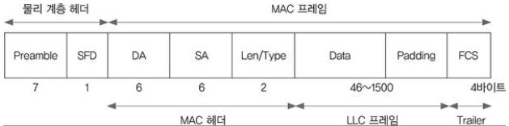
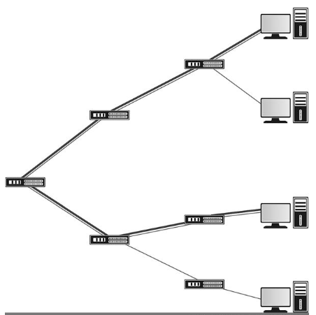
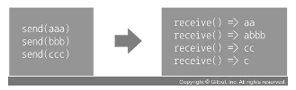
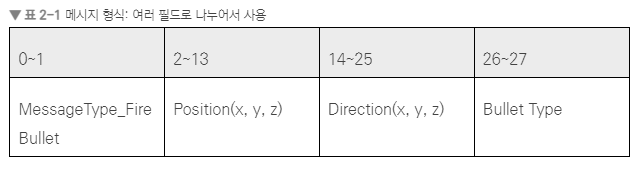
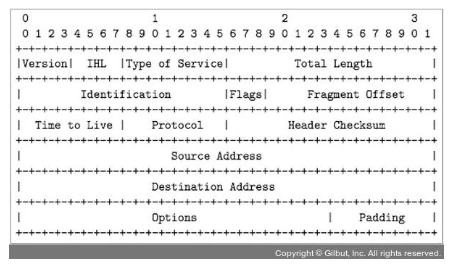
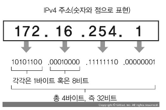
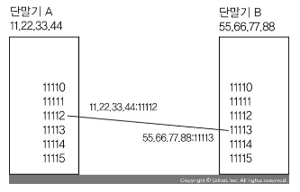
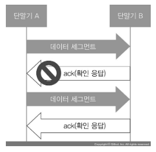
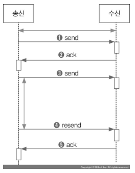

# 컴퓨터 네트워크

## 2.1.1 OSI 모델

    
- 계층 1 : 물리 계층
      
  - 물리 계층에서는 하드웨어를 다룹니다. 예를 들어 보낼 데이터를 어떤 파형의 전류로 보낼지 등을 정의합니다.
    
- 계층 2 : 데이터 링크 계층
     
  - 로컬 지역 네트워크(LAN)에서 통신을 가능하게 합니다.
    
- 계층 3 : 네트워크 계층
      
  - 광역 통신망(WAN)에서 통신을 가능하게 합니다.
    
- 계층 4 : 전송 계층
  - 이 계층에서는 상대방에게 데이터가 반드시 도착하게 된다.
  - 계층 2에서는 상대방에게 데이터가 변조 없이 가게는 하지만, 반드시 가게 하는 것은 아니다.

- 계층 5 : 세션계층, 계층 6 : 표현 계층, 계층 7 : 응용 계층
  - 응용 프로그램이나 운영체제 안 모듈이 다른 컴퓨터의 응용 프로그램이나 운영체제 모듈과 통신을 하는 동안 논리적 연결 단위나 기능들은 계층 5~7에서 다룹니다.
  - 그 예로 동영상 스트리밍 통신 규약(MPEG), 통신 암호화 규약(SSL), 웹 브라우저와 웹 서버 간 통신 규약(HTTP) 
  
## OSI 모델 계층 2

간단하게 OSI모델 계층 2를 설명하자면
- 각 단말기는 고유한 주소를 갖는다.
- 단말기는 데이터를 `프레임(frame)`이라는 단위로 주고 받습니다.

OSI 모델의 계층 2를 구성하는 단말기들은 작은 마을 과 같다. 각 단말기는 서로 다른 주소를 가져야 하며, 데이터는 편지에 해당한다.

편지지 내용에 해당하는 것이 `데이터` 이며, 이를 `페이로드(payload)`라고 한다.

편지지 봉투에는 수신자와 송신자를 적는다, 이를 `헤더(header)` 라고 한다.

> 즉 `헤더`와 `페이로드`를 합친 결과물을 `프레임` 이라고 한다.

## OSI 모델 계층 3

서로 다른 LAN과 LAN이 연결되어 WAN(Wide Area NetWork) 혹은 광역 통신망 이라고 한다.

WAN의 모든 단말기는 계층 3에서 요구하는 형식의 주소를 가진다.

- WAN에서는 직접 데이터를 건네는 것이 아니라, 계층적으로 데이터를 건네주는 방식으로 작동한다.
- 어떤 데이터가 단말기에서 스위치로 갔는데 그 데이터를 스위치가 직접 건네줄 수 없는 곳에 있으면, 이를 취급하는 곳으로 데이터를 보내야 한다.
- 위 같은 일을 담당하는 네트워크 기기를 `라우터(router)`라고 한다.

- 간단히 말해서 `라우터는 서로 다른 LAN 사이에 컴퓨터 통신을 할 수 있게 하는 장비이다.`

계층 3에서 흔히 접하는 것은 `인터넷 프로토콜` 혹은 `IP`라고 하는 것이다.
인터넷 프로토콜에서는 주소 형식이 8비트 숫자 4개로 구성되어 있다. 우리가 흔히 IP 주소 라고 칭하는 것이다.

> 단말기 A에서 데이터 X를 다른 단말기 B로 보내려면, 데이터 X는 OSI모델 계층 3의 `인터넷 프로토콜에` 의해 `IP패킷` 형태로 포장된다.
> 단말기 B가 A와 같은 LAN이면 데이터 X는 스위치를 거쳐 바로 단말기 A로 간다.
> 하지만 단말기 B가 다른 LAN에 있을 때 데이터X는 LAN에 연결된 라우터를 통해 LAN 바깥으로 나가 다른 LAN으로 들어간다.

## 2.2 인터넷

서로 다른 종류의 많은 스위치와 라우터가 연결되어 지구를 뒤덮고 있다. 이를 인터넷 이라고 한다.

## 2.3.1 스트림 형식

`스트림` 이란 데이터의 흐름이다. 두 단말기를 연결 한 후 그 연결을 끊기 전까지 한쪽 에서 다른 한쪽으로 연결된 데이터 흐름 하나를 말한다.

스트림 안에 있는 데이터를 중간에 끊는 것은 개발자인 우리의 몫이며 `스트림 자체는 데이터를 중간에 구별하지 않는다.`

스트림은 파일 읽기, 쓰기에서 언급하는 스트림과 같다.

~~~
PrintFileContents()
{
  fp = OpenFile("a.txt");
  while (!fp.IsEOF())
  {
      data = fp.ReadStream(100);
      Print(data);
  }
}
~~~

- 먼저 파일을 열고 100바이트씩 읽어들인다. 이때 실제로 읽어 들이는 데이터가 항상 100바이트 인것은 아니다. 그 이하 이거나 0 바이트만 읽을 수 있다.

- 즉 보낸 데이터와 꺼내오는 데이터가 다를 수가 있다는 것이다. 하지만 꺼내오는 데이터를 모두 이어보면 보낸 데이터와 같다.

- 인터넷 프로그램은 이러한 특징을 고려할 수 밖에 없으며 이는 `TCP 프로토콜이` 이러한 성질을 가지기 때문이다.

- 따라서 스트림 형식으로 데이터를 송수신 할 때 데이터가 여러 부분으로 나뉘어 있다면 이것을 따로 정의해 주어야 한다.

- 데이터를 보내기전에 보낼 데이터의 크기를 먼저 보내는 방식은 `헤더`를 붙이는 방식 이라고 한다.

- 데이터 시작과 끝을 알리는 기호를 추가하는 방식은 `구분자`를 이용하는 방식
  - 구분자 방식 사용시 데이터 안에 구분자 값이 사용 될 수 있어 구분자와 데이터를 구별할 수 있는 `Base64` 나 `escape sequence` 처리가 그 예 이다.
  

## 2.3.2 메시지 형식

스트림과 달리 메시지는 자체적으로 데이터 시작과 끝을 구별할 수 있다. 따라서 보낸 개수와 받는 개수가 같으며 시작과 끝도 같다.

이렇게 각 데이터가 정확히 구별되는 것을 메시지 형식 이라고 한다.

위 그림처럼 여러 필드로 나누어 사용하면 된다.

  - IP 패킷의 특징
    - IP 패킷에는 `데이터`, 즉 `페이로드 크기와 송신자 주소, 수신자 주소, 체크섬` 등이 들어 있다.
    
    

위 그림은 패킷의 구조 이다.

- IP 패킷 하나의 크기는 제한되어 있다. 크기 제한은 라우터 마다 다르지만 보통 `1300바이트` 정도로, 작게는 `600 바이트` 부터 크게는 `9000 바이트` 까지 이른다.
- 스트림이나 메시지에는 이러한 제한이 없다.
- 운영체제에 내장된 네트워크 모듈인 네트워크 스택에서 프로그램이 보내고 받는 스트림과 메시지를 관리해준다.

- 프로그램이 매우 긴 스트림을 송신할 때 운영체제는 이를 IP 패킷의 크기 제한에 맞추어 여러 조각을 내며 이를 `단편화` 라고 한다.
- 받는 쪽 에서는 이 조각들을 받아 조립한 후 스트림 형태로 복원한다.

## 2.4 컴퓨터 네트워크 식별자

- 인터넷 프로토콜 에서는 모든 기기가 IP 주소를 갖는다.
  - IP 주소는 크게 버전 4 주소 `IPv4` 와 6주소 형식 `IPv6`가 있다. `IPv4`는  1바이트 숫자 4개 조합으로 32 비트

  
  
  - `IPv4` 는 수십 년 동안 사용되어서 지금은 한계에 이르러 약 40억 개 이상은 배정할 수 없다. 
  - `IPv6` 는 `IPv4`의 한계를 극복하기 위해 등장하였다. 

- IP 주소 안에서  누가 주고 받는 것인지 식별하는 역할 하는 것이 바로 `포트` 이다. 포트는 2바이트 정수

> 우리가 호스트 이름을 입력하면 컴퓨터는 이를 IP 주소로 변환한다. 이 역할은 도메인 이름 서버 `DNS Server`에서 담당한다.
> DNS 서버는 전 세계 곳곳에 흩어져 있다. 우리가 호스트이름을 입력하면 DNS 서버에 물어 본다.

## 2.5.2 전송 속도와 전송 지연 시간

네트워크 품질을 거론 할 때는 `전송 속도`와 `레이턴시` 현상도 거론한다.

### 전송 속도

  - 두 기기 간에 초당 전송될 수 있는 최대 데이터양을 의미한다.
  - 초당 비트수 혹은 바이트 수 로 표현한다.
  - 전송 속도에 영향을 주는 것은 두 기기 간의 매체인 선로의 종류와 품질, 소프트웨어와 하드웨어 종류로 꼽는다.

### 레이턴시

  - 두 기기 간에 데이터를 최소량 전송할 때 걸리는 시간을 의미하며, 많이 쓰는 단위는 밀리초(ms) 이다.
  - 레이턴시에 영향을 주는 것으로는 매체의 종류와 품질, 송신자 - 수신자 사이의 라우터 처리 속도가 있다.

> 요약하자면 송신자와 수신자 간 네트워크 기기 안 하드웨어와 소프트웨어의 처리 속도도 네트워크 레이턴시의 원인이 된다.

`두 단말기 사이의 레이턴시` = `두 단말기 사이에 있는 네트워크 기기의 레이턴시 총합`

`두 단말기 사이의 스루풋` = `두 단말기 사이의 네트워크 기기 중 최소 스루풋`

## 2.5.3 네트워크 품질 기준 세가지

1. 전송 속도(스루풋)
    - 전송 속도는 전송될 수 있는 데이터의 단위 시간당 총량
    - 회선 종류가 좋을수록, 네트워크 장비의 처리속도가 빠를수록 향상
2. 패킷 유실률
    - 전송되는 데이터가 중간에 버려지는 비율이다.
    - 라우터 개수가 적을수록, 라우터의 처리 성능이 좋을수록 낮다.
3. 레이턴시
    - 데이터가 목적지에 도착하는데 걸리는 시간이다.
    - 라우터 개수가 많을수록 높다.

## 2.6.1 UDP 네트워킹

UDP는 User Datagram Protocol의 약어로 사용자가 정의한 데이터그램 을 상대방에게 보낼수 있게 하는 통신규약 이다.

- UDP를 이용하여 데이터그램을 보낼 수 있다. 약 64킬로바이트 이하의 이진 데이터로, 스트림이 아닌 `메시지` 성질을 가진다.
- 즉 데이터 일부가 뭉치거나 쪼개지지 않는다.
- UDP는 앞서 패킷 유실 현상이 발생할 수 있다. 예로 a, bb, ccc, dddd 중에 하나 이상을 못받거나 같은 데이터그램을 두번 이상 받을 가능성이 있다.
- 심지어 보낸 순서와 다르게 데이터그램을 받을 수 있다. 그난마 다행인 것은 데이터그램 내용이 훼손되지 않는다는 점이다.

> 따라서 받는 쪽에서 데이터그램 유실이나 순서 뒤바뀜 혹은 중복 수신 현상이 발생해도 괜찮을 때 만 `UDP` 를 사용하는 것이 좋다.

- 예를 들어 동영상이나 음성 데이터를 보낼 때는 중간에 좀 잃어버리더라도 뒤이어서 오는 다른 데이터들을 계속 출력해 주면 크게 불편함을 느끼지 않는다.
- 네트워크 게임에서는 캐릭터가 이동할 때 마다 계속해서 보내 주는 이동 정보 를 보낼 때 UDP를 쓰기도 한다.

`UDP` 로 데이터를 주고 받으려면 소켓(Socket)을 생성해야 한다. 소켓을 생성하면 소켓 핸들 값이 반환되며, 이는 대부분 운영체제에서 int32 타입 이다.

#### 데이터 송신
~~~
s = socket(UDP);                        
   s.bind(any_port);                       
   s.sendTo("55.66.77.88:5959", "hello");  
   s.close();
~~~

- UDP 소켓을 생성하고 포트를 할당해야 데이터를 주고 받을 수 있다. bind() 함수를 호출하면 된다.
- UDP는 기본적으로 바이너리로 데이터그램을 취급한다.

#### 데이터 수신
~~~
   s = socket(UDP);
    s.bind(5959);                  // 
    r = s.recvfrom();              // 
    print(r.srcAddrPort, r.data);  // 
    s.close();
~~~

- 실제로는 위처럼 하면 안되고 `close()`를 하기 전에 송신하려는 데이터가 송신 버퍼에서 빠져나가야 한다.

#### 다대다 통신

UDP의 또 다른 특징은 다대다 통신이 가능하다. 상대방의 EndPoint만 알면 우편을 보내듯이 보내면된다.

UDP는 사용법이 간단한 반면, 데이터 유실 또는 순서 뒤바뀜 같은 문제가 생긴다는 단점이 있습니다. 따라서 데이터를 보낸 순서와 똑같이 받으려면 데이터가 정확하게 왔는지 검사하고, 잘못되었으면 다시 보내는 대책이 필요합니다

## 2.6.2 TCP 네트워킹

TCP(Transmission Control Protocol)는 보내는 쪽 데이터가 받는 쪽에서 완전히 동일함을 보장해주는 프로토콜 이다.

TCP는 데이터를 주고받기 전에 `연결` 이라는 과정을 먼저 해야한다. 연결은 1 : 1 만 가능하다.

- TCP는 메시지 형태가 아니라 `스트림 형태`이다. 데이터를 뭉치거나 쪼갤 수 있다.
- UDP와 TCP는 모두 인터넷 프로토콜(IP) 위에서 작동한다. IP가 OSI모델의 계층 3에 있으니 UDP와 TCP는 계층 4에 위치한다.

- TCP는 데이터가 상대방에서 정확히 전송된다. 이는 TCP가 흐름 제어 기능을 가지고 있기 때문이다.

> TCP에서 보낼 스트림 데이터는 `세그먼트` 라는 IP 패킷에 넣을 수 있는 크기의 단위로 쪼개진다.
> 
> 그러고 나서 IP 패킷안에 `세그먼트`를 넣어서 수신자에게 전송된다.
> 
> 수신자는 IP 패킷을 받으면 여기서 세그먼트를 꺼내 받은 세그먼트 응답을 송신자에게 반송한다.
> 
> 이 응답을 `ack` 혹은 `acknowledge`라고 한다.

- 보낸 쪽에서 일정 시간 안에 세그먼트에 대한 ack 가 회신되지 않으면 상대방이 받았다는 응답이 올 때 까지 다시 세그먼트를 보낸다.

#### 송신
~~~
s = socket(TCP);                 
    s.bind(any_port);
    s.connect("55.66.77.88:5959");   
    s.send("hello");                 
    s.close();
~~~

#### 수신
~~~
s = socket(TCP);         
    s.listen(5959);          
    s2 = s.accept();         
    print(getpeeraddr(s2)); 
    while (true)
    {
        r = s2.recv();       
        if (r.length = = 0)
            break;           
        print(r);            
    }
    s2.close();   
~~~
- 소켓을 생성하고 이 소켓은 TCP 데이터 스트림을 받지 않고 listen socket 역할만 한다.
- 그러고 나서 accept() 를 실행하면 상대방에게 TCP 연결을 받을 때 까지 블로킹이 된다.
- 연결이 받아지면 새로운 socket 이 생성되고 socket의 핸들 값이 리턴된다. 상대방과는 TCP 통신은 이 새로운 소켓으로 한다.

TCP는 스트림 형식이다. 따라서 send()로 0 바이트 데이터를 보내면, 사실 아무것도 하지 않는 것과 같다.

메시지 개념이 아니라 이어진 데이터, 즉 이름 그대로 스트림 형식 이기 때문이다.

수신된 데이터 크기가 0 바이트일 때는 다르게 취급한다. TCP 소켓에 대해 recv()가 0 바이트 수신하면 이는 연결이 종료 되었음을 의미한다.

## 2.7 패킷 유실시 UDP와 TCP에서 현상

- UDP
  - 패킷 유실이 발생하면 데이터그램 자체가 유실된다.
  - 데이터그램의 크기가 클수록 유실될 확률도 높다.
  - IP 패킷은 보통 1300바이트 인데, 1만 바이트의 데이터그램을 UDP로 전송하면 운영체제는 이를 대략 1300바이트 정도 크기로 나우어 보낸다.
  - 대략 8개 정도로 나뉘어서 보내게 되고 이중 하나라도 유실되면 수신자는 8개를 모두 받지 못한다.
  - 따라서 IP 패킷 8개로 구성된 1만 바이트 짜리 데이터그램 1개는 최종 유실된다.
  > 레이턴시가 민감하거나 패킷 유실이 있어도 괜찮은 곳에서 사용(캐릭터이동, 기관총 난사, 음성이나 화상 데이터 전송, 대전 격투게임, 실시간 전략 시뮬레이션 게임)

- TCP
  - 패킷 유실이 발생하면 유실된 패킷에 대한 ack가 도착하지 않는다.
  - 송신 측에서는 ack가 올 때 까지만 기다리지만, ack가 결국 오지 않으면 다시 패킷을 보낸다.(ack 가 오지않는 패킷을 재전송 하면서 지연 시간이 발생한다.)
  - 수신 측에서는 도착하지 않은 패킷이 있으므로 다른 패킷이 다 도착하더라도 데이터 스트림을 조립하지 못한다.
  > 위에서 언급한 예를 제외한 모든 경우에서 TCP를 사용한다.

  

## 2.8 주로 사용하는 메시지 형식

- 텍스트
    - 사람이 읽을 수 있다.
    ~~~
    BuyItem<LF>
    Sword<LF>
    1<LF>
    <0x00>
    ~~~
- 바이너리
  - 사람이 읽기 어렵다
  ~~~
  0x01  |  0x0023  |  0x0001 
  ^ BuyItem
           ^ Sword
                     ^ 1
  ~~~
  
## 2.9 네트워크 주소 변환

네트워크 주소 변환 이란 다른 단말기로 전송되던 패킷의 송신자 주소나 수신자 주소가 다른것으로 변환되는 과정을 말한다.

NAT 변환을 하는 기기를 NAT 라우터 라고 한다. 일반적으로 아는 인터넷 공유기가 바로 NAT 라우터 이다.

- 3G, 4G, LTE 같은 모바일 셀룰러 통신은 매우 많은 수의 기기를 지원해야 한다.
- 스마트폰 업체들이 사용하는 대규모 사용자용 NAT 라우터를 `Carrier-grade NAT` 이라고 한다.